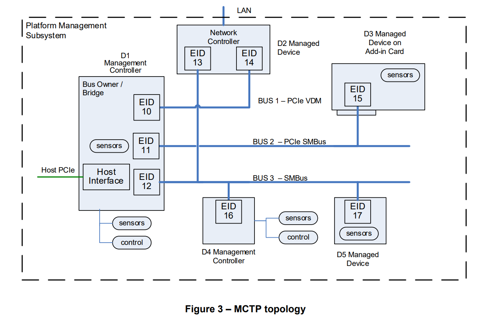
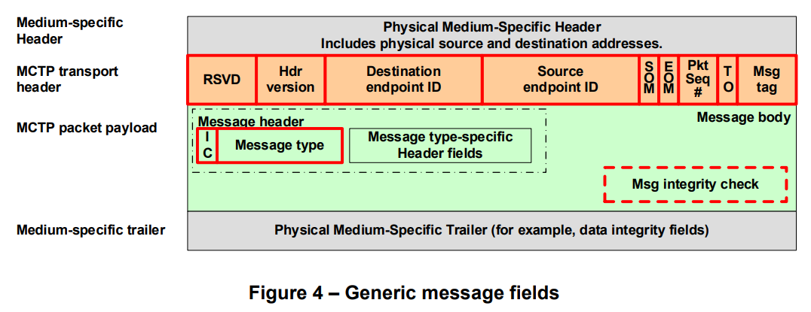

# Management Component Transport Protocol (MCTP)

Management Component Transport Protocol (MCTP) is a protocol designed by the
Distributed Management Task Force (DMTF) for communication between different
intelligent hardware components that make up a platform management subsystem,
such as a Baseboard Management Controller (BMC). It is a physical
media-independent protocol, meaning it can operate over various physical
buses like I2C/SMBus, PCI Express, and USB.

Important Links:

* [DSP0236](https://www.dmtf.org/dsp/DSP0236): MCTP Base Specification
* Transport Binding Specifications:
  * [DSP0237](https://www.dmtf.org/dsp/DSP0237): MCTP Over SMBus/I2C
  * [DSP0238](https://www.dmtf.org/dsp/DSP0238): MCTP Over PCIe VDM
* [DSP0239](https://www.dmtf.org/dsp/DSP0239): MCTP ID's & Codes
* [libmctp](https://github.com/openbmc/libmctp): Implementation of MCTP (DMTF DSP0236)

## MCTP Topology

## MCTP Packet Fields

| Field Name | Field Size | Description |
|---|---|---|
| Medium-specific header | 0 to N bytes | Transport binding specifications such as [DSP0237](https://www.dmtf.org/dsp/DSP0237) and [DSP0238](https://www.dmtf.org/dsp/DSP0238) defines the physical medium-specific header. |
| Hdr version | 4 bits | (Header version) For this version of MCTP, this field shall be set to 0001b. |
| RSVD | 4 bits | Reserved for future definition by the MCTP base specification. |
| Destination endpoint ID | 8 bits | The EID for the endpoint to receive the MCTP packet. |
| Source endpoint ID | 8 bits | The EID of the originator of the MCTP packet. |
| Msg tag | 3 bits | (Message tag) Field that, along with the Source Endpoint IDs and the Tag Owner (TO) field, identifies a unique message at the MCTP transport level. |
| TO | 1 bit | The TO (Tag Owner) bit identifies whether the message tag was originated by the endpoint that is the source of the message or by the endpoint that is the destination of the message. |
| Pkt Seq # | 2 bits | (Packet sequence number) For messages that span multiple packets, the packet sequence number increments modulo 4 on each successive packet. |
| EOM | 1 bit | (End Of Message) Set to 1b if this packet is the last packet of a message. |
| SOM | 1 bit | (Start Of Message) Set to 1b if this packet is the first packet of a message. |
| Message type | 7 bits | See [DSP0239](https://www.dmtf.org/dsp/DSP0239) for the information of message type values. |
| IC | 1 bit | 0b = No MCTP message integrity check, 1b = MCTP message integrity check is present |
| Message type-specific header fields | Message type-specific | Header associated with the particular message type. Defined according to the specifications for the message type. |
| Message data | Message type-specific | Data associated with the particular message type. Defined according to the specifications for the message type. |
| Msg integrity check | Message type-specific | (MCTP message integrity check) This field represents the optional presence of a message type-specific integrity check over the contents of the message body. |
| Medium-specific trailer | Medium-specific | This field represents any additional medium-specific trailer fields (if any) that are required for transferring MCTP packets between devices on a particular physical medium. |

## Special Endpoint IDs

The following table lists EID values that are reserved or assigned to specific
functions for MCTP.

| EID | Description |
|---|---|
| Destination endpoint 0 | This enables communication with devices that have not been assigned an EID. MCTP does not support bridging messages with a null destination EID between different buses. |
| Source endpoint ID 0 | This would typically be used for messages that are delivered from an endpoint that has not been assigned an EID. MCTP does not support bridging messages with a null source EID between different buses. |
| Endpoint IDs 1 through 7 | Reserved for future definition. |
| Endpoint ID 0xFF | Reserved for use as a broadcast EID on a given bus. Primarily for use by the MCTP control message type. |
| All other values | Available for assignment and allocation to endpoints. |

## Message Types

All the message types are defined in [DSP0239](https://www.dmtf.org/dsp/DSP0239).

| Message Type | Message Type Code | Description |
|---|---|---|
| MCTP control | 0x00 | Messages used to support initialization and configuration of MCTP communication within an MCTP network, as specified in [DSP0236](https://www.dmtf.org/dsp/DSP0236). |
| Platform Level Data Model (PLDM) | 0x01 | Messages used to convey Platform Level Data Model (PLDM) traffic over MCTP, as specified in [DSP0241](https://www.dmtf.org/dsp/DSP0241). |
| NC-SI over MCTP | 0x02 | Messages used to convey NC-SI Control traffic over MCTP, as specified in [DSP0261](https://www.dmtf.org/dsp/DSP0261). |
| Ethernet over MCTP | 0x03 | Messages used to convey Ethernet traffic over MCTP as specified in [DSP0261](https://www.dmtf.org/dsp/DSP0261). |
| NVMe Management Messages over MCTP | 0x04 | Messages used to convey NVM Express (NVMe) Management Messages over MCTP, as specified in [DSP0235](https://www.dmtf.org/dsp/DSP0235). |
| SPDM over MCTP | 0x05 | Messages used to convey Security Protocol and Data Model Specification (SPDM) traffic over MCTP, as specified in [DSP0275](https://www.dmtf.org/dsp/DSP0275). |
| Secured Messages | 0x06 | Messages used to convey Secured Messages using SPDM over MCTP Binding Specification traffic, as specified in [DSP0276](https://www.dmtf.org/dsp/dsp0276). |
| CXL FM API over MCTP | 0x07 | Messages used to convey CXL™ Fabric Manager API over MCTP Binding Specification traffic as specified in [DSP0234](https://www.dmtf.org/dsp/DSP0234). |
| CXL CCI over MCTP | 0x08 | Messages used to convey CXL™ Type 3 Device Component Command Interface over MCTP Binding Specification traffic as specified in [DSP0281](https://www.dmtf.org/dsp/DSP0281). |
| PCIe-MI over MCTP | 0x09 | Messages used to convey PCIe Management Interface (PCIe-MI) over MCTP Binding Specification traffic as specified in [DSP0291](https://www.dmtf.org/dsp/DSP0291). |
| Vendor Defined – PCI | 0x7E | Message type used to support VDMs where the vendor is identified using a PCI-based vendor ID. The specification of the format of this message is given in [DSP0236](https://www.dmtf.org/dsp/DSP0236). Otherwise, the message body content is specified by the vendor, company, or organization identified by the given vendor ID. |
| Vendor Defined – IANA | 0x7F | Message type used to support VDMs where the vendor is identified using an IANA-based vendor ID. |
| Reserved | All other | Reserved |

[<- Back](../index.md)
