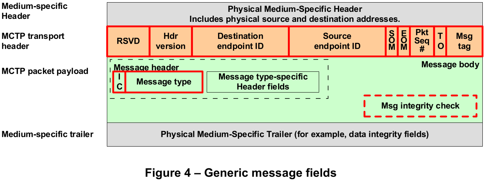

# Management Component Transport Protocol (MCTP)

- [Overview](#1-overview)
- [MCTP Base Protocol](#2-mctp-base-protocol)
  - [MCTP Packet Fields](#21-mctp-packet-fields)
  - [Special Endpoint IDs](#22-special-endpoint-ids)
  - [Packet payload and transmission unit sizes](#23-packet-payload-and-transmission-unit-sizes)
  - [Message Assembly](#24-message-assembly)
  - [Message Types](#25-message-types)
  - [MCTP Discovery and Addressing](#26-mctp-discovery-and-addressing)
- [MCTP Bridging](#3-mctp-bridging)
  - [EID Options for Bridges](#31-eid-options-for-bridges)
  - [Routing Table](#32-routing-table)
    - [Briding Process Overview](#331-briding-process-overview)
    - [Routing Table Creation](#332-routing-table-creation)
- [MCTP Control Protocol](#4-mctp-control-protocol)
  - [MCTP Control Message Format](#41-mctp-control-message-format)
  - [Tag Owner (TO), Request (Rq) and Datagram (D) bit usage](#42-tag-owner-to-request-rq-and-datagram-d-bit-usage)
  - [MCTP Control Message Command Codes](#43-mctp-control-message-command-codes)
  - [MCTP Control Message Completion Codes](#44-mctp-control-message-completion-codes)
  - [MCTP Control Messages](#45-mctp-control-messages)
    - [Set Endpoint ID](#451-set-endpoint-id)
    - [Get Endpoint ID](#452-get-endpoint-id)

## 1. Overview

Management Component Transport Protocol (MCTP) is a protocol designed by the
Distributed Management Task Force (DMTF) for communication between different
intelligent hardware components that make up a platform management subsystem,
such as a Baseboard Management Controller (BMC). It is a physical
media-independent protocol, meaning it can operate over various physical
buses like I2C/SMBus, PCI Express, and USB.

Important Links:

- [DSP0236](https://www.dmtf.org/dsp/DSP0236): MCTP Base Specification
- Transport Binding Specifications:
  - DSP0283: MCTP over USB
  - [DSP0237](https://www.dmtf.org/dsp/DSP0237): MCTP Over SMBus/I2C
  - [DSP0238](https://www.dmtf.org/dsp/DSP0238): MCTP Over PCIe VDM
- [DSP0239](https://www.dmtf.org/dsp/DSP0239): MCTP ID's & Codes
- [libmctp](https://github.com/openbmc/libmctp): Implementation of MCTP (DMTF DSP0236)

Reference: [DSP0236](https://www.dmtf.org/dsp/DSP0236)


## 2. MCTP Base Protocol

The MCTP base protocol defines the common fields for MCTP packets and messages and
their usage.

### 2.1 MCTP Packet Fields



MCTP transport header:

| Field Name | Bit(s) | Description |
|---|---|---|
| RSVD | 31:28 | Reserved for future definition by the MCTP base specification. |
| Hdr version | 27:24 | (Header version) For this version of MCTP, this field shall be set to 0001b. |
| Destination endpoint ID | 23:16 | The EID for the endpoint to receive the MCTP packet. |
| Source endpoint ID | 15:8 | The EID of the originator of the MCTP packet. |
| SOM | 7:7 | (Start Of Message) Set to 1b if this packet is the first packet of a message. |
| EOM | 6:6 | (End Of Message) Set to 1b if this packet is the last packet of a message. |
| Pkt Seq # | 5:4 | (Packet sequence number) For messages that span multiple packets, the packet sequence number increments modulo 4 on each successive packet. |
| TO | 3:3 | The TO (Tag Owner) bit identifies whether the message tag was originated by the endpoint that is the source of the message or by the endpoint that is the destination of the message. |
| Msg tag | 2:0 | (Message tag) Field that, along with the Source Endpoint IDs and the Tag Owner (TO) field, identifies a unique message at the MCTP transport level. |

Medium specific MCTP packet:

| Field Name | Field Size | Description |
|---|---|---|
| Medium-specific header | 0 to N bytes | Transport binding specifications such as [DSP0237](https://www.dmtf.org/dsp/DSP0237) and [DSP0238](https://www.dmtf.org/dsp/DSP0238) defines the physical medium-specific header. |
| MCTP transport header | 32 bits | The MCTP transport header is part of each MCTP packet and provides version and addressing information for the packet as well as flags |
| Message type | 7 bits | See [DSP0239](https://www.dmtf.org/dsp/DSP0239) for the information of message type values. |
| IC | 1 bit | 0b = No MCTP message integrity check, 1b = MCTP message integrity check is present |
| Message type-specific header fields | Message type-specific | Header associated with the particular message type. Defined according to the specifications for the message type. |
| Message body | Message type-specific | Data associated with the particular message type. Defined according to the specifications for the message type. |
| Msg integrity check | Message type-specific | (MCTP message integrity check) This field represents the optional presence of a message type-specific integrity check over the contents of the message body. |
| Medium-specific trailer | Medium-specific | This field represents any additional medium-specific trailer fields (if any) that are required for transferring MCTP packets between devices on a particular physical medium. |

### 2.2 Special Endpoint IDs

The following table lists EID values that are reserved or assigned to specific
functions for MCTP.

| EID | Description |
|---|---|
| Destination endpoint 0 | This enables communication with devices that have not been assigned an EID. MCTP does not support bridging messages with a null destination EID between different buses. |
| Source endpoint ID 0 | This would typically be used for messages that are delivered from an endpoint that has not been assigned an EID. MCTP does not support bridging messages with a null source EID between different buses. |
| Endpoint IDs 1 through 7 | Reserved for future definition. |
| Endpoint ID 0xFF | Reserved for use as a broadcast EID on a given bus. Primarily for use by the MCTP control message type. |
| All other values | Available for assignment and allocation to endpoints. |

### 2.3 Packet payload and transmission unit sizes

For MCTP, the size of a transmission unit is defined as the size of the packet
payload that is carried in an MCTP packet.

```text
Header size = 4 bytes
Payload size = 64 bytes
Total packet size = Header size + Payload size = 68 bytes
```

### 2.4 Message Assembly

Multiple-packet message assembly is when the endpoint corresponding to the
destination EID in the packet receives

- A valid "start" packet (packet with SOM = 1b and EOM = 0b)
- A valid "middle" packet (packet with SOM = 0b and EOM = 0b)
- A valid "end" packet (packet with SOM = 1b and EOM = 1b)

A packet with both SOM = 1b and EOM = 1b is considered to be a single-packet
message, and is not assembled per se.

### 2.5 Message Types

All the message types are defined in [DSP0239](https://www.dmtf.org/dsp/DSP0239).

| Message Type | Message Type Code | Description |
|---|---|---|
| MCTP control | 0x00 | Messages used to support initialization and configuration of MCTP communication within an MCTP network, as specified in [DSP0236](https://www.dmtf.org/dsp/DSP0236). |
| Platform Level Data Model (PLDM) | 0x01 | Messages used to convey Platform Level Data Model (PLDM) traffic over MCTP, as specified in [DSP0241](https://www.dmtf.org/dsp/DSP0241). |
| NC-SI over MCTP | 0x02 | Messages used to convey NC-SI Control traffic over MCTP, as specified in [DSP0261](https://www.dmtf.org/dsp/DSP0261). |
| Ethernet over MCTP | 0x03 | Messages used to convey Ethernet traffic over MCTP as specified in [DSP0261](https://www.dmtf.org/dsp/DSP0261). |
| NVMe Management Messages over MCTP | 0x04 | Messages used to convey NVM Express (NVMe) Management Messages over MCTP, as specified in [DSP0235](https://www.dmtf.org/dsp/DSP0235). |
| SPDM over MCTP | 0x05 | Messages used to convey Security Protocol and Data Model Specification (SPDM) traffic over MCTP, as specified in [DSP0275](https://www.dmtf.org/dsp/DSP0275). |
| Secured Messages | 0x06 | Messages used to convey Secured Messages using SPDM over MCTP Binding Specification traffic, as specified in [DSP0276](https://www.dmtf.org/dsp/dsp0276). |
| CXL FM API over MCTP | 0x07 | Messages used to convey CXL™ Fabric Manager API over MCTP Binding Specification traffic as specified in [DSP0234](https://www.dmtf.org/dsp/DSP0234). |
| CXL CCI over MCTP | 0x08 | Messages used to convey CXL™ Type 3 Device Component Command Interface over MCTP Binding Specification traffic as specified in [DSP0281](https://www.dmtf.org/dsp/DSP0281). |
| PCIe-MI over MCTP | 0x09 | Messages used to convey PCIe Management Interface (PCIe-MI) over MCTP Binding Specification traffic as specified in [DSP0291](https://www.dmtf.org/dsp/DSP0291). |
| Vendor Defined – PCI | 0x7E | Message type used to support VDMs where the vendor is identified using a PCI-based vendor ID. The specification of the format of this message is given in [DSP0236](https://www.dmtf.org/dsp/DSP0236). Otherwise, the message body content is specified by the vendor, company, or organization identified by the given vendor ID. |
| Vendor Defined – IANA | 0x7F | Message type used to support VDMs where the vendor is identified using an IANA-based vendor ID. |
| Reserved | All other | Reserved |

### 2.6 MCTP Discovery and Addressing

This clause describes how MCTP endpoints, and their capabilities are discovered
by one another, and how MCTP endpoints are provisioned with the addresses
necessary for MCTP communication.

MCTP discovery occurs over the course of several discrete, ordered steps:

- Bus enumeration
- Bus address assignment
- MCTP capability discovery
- Endpoint ID assignment
- Distribution and use of routing information

## 3. MCTP Bridging

One key capability provided by MCTP is its ability to route messages between
multiple buses and between buses of different types.

- An MCTP bridge is responsible for routing MCTP packets between at least two buses.
- An MCTP bridge is typically the bus owner for at least one of those buses.

### 3.1 EID Options for Bridges

An MCTP bridge that connects to multiple buses can have a single EID or multiple
EIDs through which the bridge’s routing configuration and endpoint functionality
can be accessed through MCTP control commands. There are three general options:

- The bridge uses a single MCTP endpoint. Referred in diagram A.
- The bridge uses an MCTP endpoint for each bus that connects to a bus owner.
  Referred in diagram B.
- The bridge uses an MCTP endpoint for every bus to which it connects.
 Referred in diagram C.


### 3.2 Routing Table

An MCTP bridge maintains a routing table where each entry in the table associates
either a single EID or a range of EIDs with a single physical address and bus ID
for devices that are on buses that are directly connected to the bridge.

Basic routing table entry in routing table will be comprised of at least three
elements: An EID range, a bus identifier, and a bus address

```text
------------------------------------
| EID Range | Bus ID | Bus Address |
------------------------------------
```

- The EID range specifies the set of EIDs that can be reached through a
particular bus address on a given bus. Because the bus ID and bus address
may correspond to a particular "port" on a bridge, it is possible that there
can be multiple non-contiguous ranges (multiple routing table entries) that
have the same bus ID/bus address pair route.
- The bus ID is an internal identifier that allows the MCTP device to identify
the bus that correlates to this route. MCTP does not require particular values
to be used for identifying a given physical bus connection on a device. However,
this value will typically be a 0-based numeric value.
- The bus address is the physical address of a specific device on the bus through
which the EIDs specified in the EID range can be reached. This can either be
the physical address corresponding to the destination endpoint, or it can be
the physical address of the next bridge in the path to the device. The format
of this address is specific to the particular physical medium and is defined
by the physical medium transport binding.

#### 3.3.1 Briding Process Overview

When a bridge receives an MCTP packet, the following process occurs:

1. The bridge checks to see whether the destination EID in the packet matches or
falls within the range of EIDs in the table.
1. If the EID is for the bridge itself, the bridge internally consumes the packet.
1. If there is a match with an entry in the routing table, the following steps happen:
    - The bridge changes the physical addresses in the packet and reformats the
    medium-specific header and trailer fields as needed for the destination bus.
    - The destination physical address from the source bus is replaced with the
    destination physical address for the destination bus obtained from the entry
    in the routing table.
    - The bridge replaces the source physical address in the packet it received
    with the bridge’s own physical address on the target bus. This is necessary
    to enable messages to be routed back to the originator.
    - Packet-specific transport header and data integrity fields are updated as
    required by the particular transport binding.
1. If there is no match, packets with EID values that are not in the routing
table are silently discarded.

#### 3.3.2 Routing Table Creation


Starting with the description of what bridge Y requires, the following task
list shows the steps that bridge X shall take to provide routing information
for bus 1. Bridge X shall:

- Assign EIDs to devices A, B, C, D, bridge Y, and bridge Z. This is done using
the Set Endpoint ID command. The response of the Set Endpoint ID command also
indicates whether a device wants an additional pool of EIDs.
- Allocate EID pools to bridge Y and bridge Z. This is done using the Allocate
Endpoint IDs command.
- Tell bridge Y
  - EIDs 11, 12, 13, and 17 of devices bridge X (itself), A, B and
  bridge Z on bus 1.
  - EIDs 18:19 are accessed through the physical address for bridge Z on bus 1.
  - EIDs 8:10 are accessed through bridge X on bus 1.
  - This is done using the Routing Information Update command.
- Tell bridge Z
  - EIDs 11, 12, 13, and 14 of device bridge X (itself), A, B, and bridge Y on
  bus 1.
  - EIDs 15:16 are accessed through the physical address for bridge Y on bus 1.
  - EIDs 8:10 are accessed through bridge X on bus 1.
  - This is done using the Routing Information Update command.

## 4. MCTP Control Protocol

MCTP control messages are used for the setup and initialization of MCTP
communications within an MCTP network. This clause defines the protocol
and formatting used for MCTP control messages over MCTP.

### 4.1 MCTP Control Message Format


These are common fields for MCTP control messages.

| Bit(s) | Field Name | Description |
|---|---|---|
| 31:24 | Completion Code | This field is only present in Response messages. This field contains a value that indicates whether the response completed normally. If the command did not complete normally, the value can provide additional information regarding the error condition. |
| 23:16 | Command Code    | For Request messages, this field is a command code indicating the type of MCTP operation the packet is requesting. Command code values are defined in Table 12. The format and definition of request and response parameters for the commands is given in Clause 12. The Command Code that is sent in a Request shall be returned in the corresponding Response. |
| 15:15 | Rq bit          | Request bit. This bit is used to help differentiate between MCTP control Request messages and and other message classes. |
| 14:14 | D-bit           | Datagram bit. This bit is used to indicate whether the Instance ID field is being used for tracking and matching requests and responses or is just being used to identify a retransmitted message. |
| 13:13 | Reserved        | |
| 12:8  | Instance ID     | The instance id is used to track the response messages from Command/Request and Broadcast Request class of messages. |
| 7:7   | IC              | Message Integrity Check bit = 0b. MCTP control messages do not include an overall Message Integrity check field. |
| 6:0   | Message Type    | MCTP control = 0x00 (000_0000b). This field identifies the MCTP message as being an MCTP control message. |

### 4.2 Tag Owner (TO), Request (Rq) and Datagram (D) bit usage

| MCTP Control Message Class | Destination EID Value | Tag Owner (TO) bit | Request (Rq) bit | Datagram (D) bit |
|--------------------|---------------|----|----|----|
| Command/Request    | Target EID    | 1b | 1b | 0b |
| Response           | Target EID    | 0b | 0b | 0b |
| Broadcast Request  | Broadcast EID | 1b | 1b | 0b |
| Datagram           | Target EID    | 1b | 1b | 1b |
| Broadcast Datagram | Broadcast EID | 1b | 1b | 1b |

### 4.3 MCTP Control Message Command Codes

| Command Code | Command Name                       | Description                                                                                                                                     |
|--------------|------------------------------------|-------------------------------------------------------------------------------------------------------------------------------------------------|
| 0x00         | Reserved                           | Reserved                                                                                                                                        |
| 0x01         | Set Endpoint ID                    | Assigns an EID to the endpoint at the given physical address                                                                                    |
| 0x02         | Get Endpoint ID                    | Returns the EID presently assigned to an endpoint. Also returns information about what type the endpoint is and its level of use of static EIDs |
| 0x03         | Get Endpoint UUID                  | Retrieves a per-device unique UUID associated with the endpoint                                                                                 |
| 0x04         | Get MCTP Version Support           | Lists which versions of the MCTP control protocol are supported on an endpoint                                                                  |
| 0x05         | Get Message Type Support           | Lists the message types that an endpoint supports                                                                                               |
| 0x06         | Get Vendor Defined Message Support | Used to discover an MCTP endpoint’s vendor-specific MCTP extensions and capabilities                                                            |
| 0x07         | Resolve Endpoint ID                | Used to get the physical address associated with a given EID                                                                                    |
| 0x08         | Allocate Endpoint IDs              | Used by the bus owner to allocate a pool of EIDs to an MCTP bridge                                                                              |
| 0x09         | Routing Information Update         | Used by the bus owner to extend or update the routing information that is maintained by an MCTP bridge                                          |
| 0x0A         | Get Routing Table Entries          | Used to request an MCTP bridge to return data corresponding to its present routing table entries                                                |
| 0x0B         | Prepare for Endpoint Discovery     | Used to direct endpoints to clear their “discovered” flags to enable them to respond to the Endpoint Discovery command                          |
| 0x0C         | Endpoint Discovery                 | Used to discover MCTP-capable devices on a bus, provided that another discovery mechanism is not defined for the particular physical medium     |
| 0x0D         | Discovery Notify                   | Used to notify the bus owner that an MCTP device has become available on the bus                                                                |
| 0x0E         | Get Network ID                     | Used to get the MCTP network ID                                                                                                                 |
| 0x0F         | Query Hop                          | Used to discover what bridges, if any, are in the path to a given target endpoint and transmission unit sizes supported                         |
| 0x10         | Resolve UUID                       | Used by endpoints to find another endpoint matching a specific UUID                                                                             |
| 0x11         | Query Rate Limit                   | Used to discover the data rate limit settings of the given target for incoming messages                                                         |
| 0x12         | Request TX Rate Limit              | Used to request the allowed transmit data rate limit for the given endpoint for outgoing messages                                               |
| 0x13         | Update Rate Limit                  | Used to update the receiving side on change to the transmit data rate which was not requested by the receiver                                   |
| 0x14         | Query Supported Interfaces         | Used to discover the existing device MCTP interfaces                                                                                            |
| 0xF0–0xFF    | Transport Specific                 | Reserved for transport binding-specific commands. Used for setup and configuration specific to a physical medium                                |

### 4.4 MCTP Control Message Completion Codes

| Value      | Name                   | Description |
|------------|------------------------|-------------|
| 0x00       | SUCCESS                | The Request was accepted and completed normally. |
| 0x01       | ERROR                  | This is a generic failure message. (It should not be used when a more specific result code applies.) |
| 0x02       | ERROR_INVALID_DATA     | The packet payload contained invalid data or an illegal parameter value. |
| 0x03       | ERROR_INVALID_LENGTH   | The message length was invalid. (The Message body was larger or smaller than expected for the particular request.) |
| 0x04       | ERROR_NOT_READY        | The Receiver is in a transient state where it is not ready to receive the corresponding message. |
| 0x05       | ERROR_UNSUPPORTED_CMD  | The command code field of the received message is unspecified or not supported on this endpoint. This completion code shall be returned for any unsupported command values received in MCTP control Request messages. |
| 0x80–0xFF  | COMMAND_SPECIFIC       | This range of completion code values is reserved for values that are specific to a particular MCTP control message. The particular values (if any) and their definition is provided in the specification for the particular command. |
| All other  | Reserved               | Reserved |

### 4.5 MCTP Control Messages

#### 4.5.1 Set Endpoint ID

Bus owner sends the Set EID request message to assign EID to a particular device.

Set EID Request Message (Length: 5 bytes):

| Bit(s) | Field Name | Field Value |
|-------|-----------------|---|
| 39:32 | Endpoint ID     | 0xFF, 0x00 = illegal |
| 31:26 | Reserved        | |
| 25:24 | Operation       | 00b = set EID, 01b = force EID, 10b = reset EID, 11b = set discovered flag |
| 23:16 | Command Code    | 0x01 |
| 15:15 | Rq bit          | 1b |
| 14:14 | D-bit           | 0b |
| 13:13 | Reserved        | 0b |
| 12:8  | Instance ID     | 0_0001b |
| 7:7   | Integrity Check | 0b |
| 6:0   | Message Type    | 000_0000b |

Set EID Response Message (Length: 7 bytes):

| Bit(s) | Field Name | Field Value |
|-------|-----------------------|----------------------------------------|
| 55:48 | EID Pool Size         | This is the size of the dynamic EID pool that the bridge needs. |
| 47:40 | EID setting           | If EID accepted, this value is newly set EID. Otherwise, this value is the present EID setting |
| 39:38 | Reserved              | |
| 37:36 | EID assignment status | 00b = EID assignment accepted, 01b = EID assignment rejected |
| 35:34 | Reserved              | |
| 33:32 | EID allocation status | 00b = doesn't require EID pool, 01b = requires EID pool, 10b = already allocated EID pool |
| 31:24 | Completion Code       | Any of the codes listed in [section 4.4](#44-mctp-control-message-completion-codes) |
| 23:16 | Command Code          | 0x01 |
| 15:15 | Rq bit                | 0b |
| 14:14 | D-bit                 | 0b |
| 13:13 | Reserved              | 0b |
| 12:8  | Instance ID           | 0_0001b |
| 7:7   | Integrity Check       | 0b |
| 6:0   | Message Type          | 000_0000b |

#### 4.5.2 Get Endpoint ID

Bus owner sends the Get EID request message to a particular device.
The device return the endpoint ID in the response message.

Get EID Request Message (Length: 3 bytes):

| Bit(s) | Field Name | Field Value |
|-------|-----------------|---|
| 23:16 | Command Code    | 0x02 |
| 15:15 | Rq bit          | 1b |
| 14:14 | D-bit           | 0b |
| 13:13 | Reserved        | 0b |
| 12:8  | Instance ID     | 0_0001b |
| 7:7   | Integrity Check | 0b |
| 6:0   | Message Type    | 000_0000b |

Get EID Response Message (Length: 7 bytes):

| Bit(s) | Field Name | Field Value |
|-------|-----------------------------|---|
| 55:48 | Medium-Specific Information | This byte shall be returned as 0x00 unless otherwise specified by the transport binding |
| 47:46 | Reserved                    | |
| 45:44 | Endpoint Type               | 00b = simple endpoint, 01b = bus owner/bridge |
| 43:42 | Reserved                    | |
| 41:40 | Endpoint ID Type            | 00b = dynamic EID, 01b, 10b, 11b = static EID supported |
| 39:32 | Endpoin ID                  | 0x00 if EID is not yet assigned. |
| 31:24 | Completion Code             | Any of the codes listed in [section 4.4](#44-mctp-control-message-completion-codes) |
| 23:16 | Command Code                | 0x02 |
| 15:15 | Rq bit                      | 0b |
| 14:14 | D-bit                       | 0b |
| 13:13 | Reserved                    | 0b |
| 12:8  | Instance ID                 | 0_0001b |
| 7:7   | Integrity Check             | 0b |
| 6:0   | Message Type                | 000_0000b |

[<- Back](../index.md)
